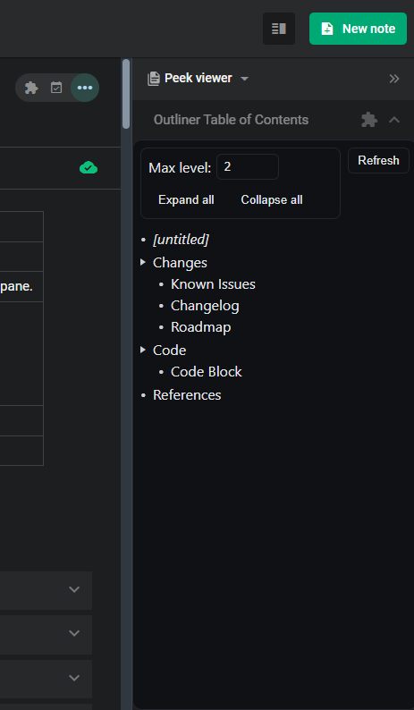

# Amplenote Plugin: Outliner

_Plugin for the amazing [Amplenote](https://www.amplenote.com/)._
Show an Outline of your Note in the Peek Viewer side pane.

More information on the [Plugin Note](https://public.amplenote.com/q7AbQNHyupxuKVS7kfXWqDAi)

## Usage

1. Install via [Amplenote Plugin Directory](https://www.amplenote.com/plugins).
2. See Plugin-Note for further instructions.

## Highlights

* Collapse deeply nested sections
* Jump to heading

## Roadmap

* Use proper frontend framework as hinted by the [Amplenote Plugin Started Pack](https://github.com/alloy-org/amplenote-embed-starter)

## Development

* `npm run build` (will also be executed as Github Action)

## Reference

* [Amplenote: Guide to Building/Developing Plugins (Beginner to Advanced)](https://www.amplenote.com/help/guide_to_developing_amplenote_plugins)
* [Amplenote: Plugin API Reference Documentation](https://assets.amplenote.com/help/developing_amplenote_plugins)

## Blablah

### License

[License](./LICENSE)

### Disclaimers

#### AI Usage

* Development has been assisted by AI
* AI contributed code (especially for "frontend"), but all of it has been reviewed by a human.

### Final Words

Thanks!
